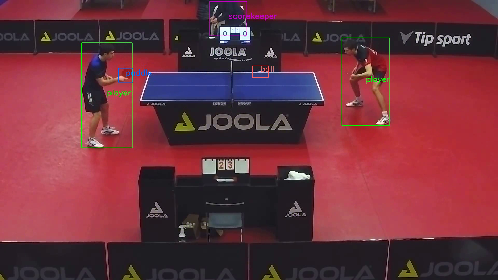

# **R**eal-time **O**bject **D**etection (ROD) for ping-pong
This project focuses on identifying specific features in a ping-pong match. The computer
vision system is created in the ubiquitous Python language. We are implementing a profound
computer vision architecture YOLO (You Only Look Once) based on YOLOv5 paper. The
exact implementation is called YOLOv8 it builds on YOLOv5 and scales it for example but there
is no official paper assigned to YOLOv8 only YOLOv5. This project is a case of object detection,
which draws bounding boxes around objects of interests and classifies them, main objects of this
thesis are person a and ping-pong paddle, although we experiment with other objects as well.
The result of this thesis is a model that is trained using method transfer-learning to accurately
detect people and somewhat accurately detect ping-pong paddles

### Example of inference on unseen data

<video src='assets/example_yolov8x.mp4' width=180/>


# Run locally

### Instal dependencies
```
conda create -n rod_ping_pong python==3.11
conda activate rod_ping_pong
pip install -r requirements.txt
python rod_ping_pong play_model.py
```
### Run model
```
python rod_ping_pong play_model.py
```

### **S**tart **L**abel Studio
```
cd rod_ping_pong/annotations
make sl
```

